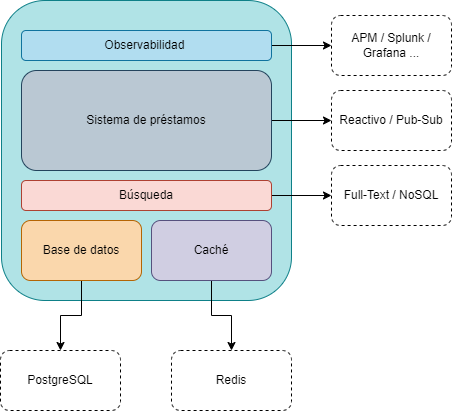
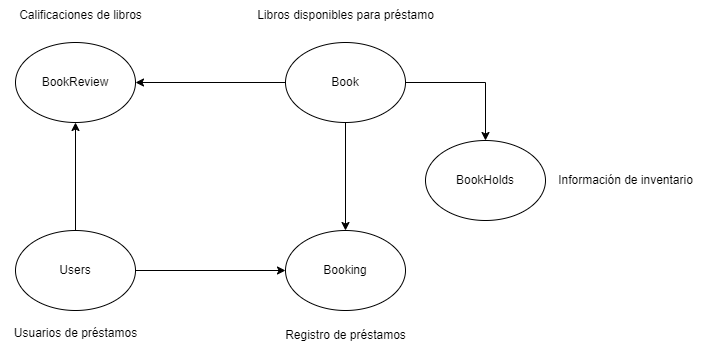

# Online Library

## Documentación de referencia
A continuación se describen las generalidades y características dentro del proyecto:

### Arquitectura
La aplicación se contruyó siguiendo un modelo tradicional de capas, empleando algunos patrones para permitir 
capacidades de escalabilidad y extensión:

* Se emplean como tecnologías: Java 21, SpringBoot, h2, EhCache.
* Patrones: MVC, Builder, Strategy, DAO, entre otros.
* Dado el contexto del negocio, la aplicación se diseñó de tal manera que sea posible extender a otros elementos diferentes
a los libros, permitiendo englobar diferentes tipos de ítems a futuro, y clasificarlos de acuerdo a normativas como *MARC21*.
* Para efectos de validaciones y pruebas locales, el sistema emplea un motor de base de datos *h2*, documentado con la ayuda
de *Liquibase*, para hacerlo escalable a motores más eficientes como lo es PostgreSQL.
* El mecanismo de búsqueda empleado, aprovecha el patrón strategy para modificar la fuente de datos.
Actualmente haciendo uso de una vista diseñada desde la misma base de datos, que permite buscar sea por título, autor o ISBN.
El objetivo de este diseño es permitir un mecanismo más acertado, como lo pueda ser una búsqueda textual 
en un motor de base de datos más potente, o en un motor de indexado no relacional, sea Apache Lucene, OpenSearch, ElasticSearh.
* El mecanismo de caché, se basa en una implementación básica de EhCache, para preservar las búsquedas y calificaciones 
dentro de un periodo no mayor a 24 horas de uso. De igual manera, extensible a mecanismos más robustos y eficientes tales 
como Redis, Couchdb, Hazelcast.
* El sistema maneja un proceso de concurrencia mediante la adquisición y bloqueo de operaciones, 
haciendo uso al mismo tiempo de las capacidades de paralelismo en el almacenado de datos, 
esto con el fin de ofrecer cierto grado de rendimiento. Sin embargo, un mejor diseño se plantearía en un modelo reactivo 
o PUB/SUB, para permitir mayor trazabilidad de las acciones, seguimiento y exposición a otros servicios que lo puedan requerir.
* Con el uso de Spring Actuator, se recopila una gran mayoría de información de análisis. 
Sin embargo, la misma no se presenta de manera amigable para el usuario, por lo que como mejoras planteadas, 
estarían en el uso de sistemas más extensos de monitoreo como un APM, recopilación de trazas como Splunk o Prometeus,
y de graficación como Grafana o Kibana.

### Base de datos
Modelo simple de entidad-relación

* En este diseño, se incluyeron las siguientes tablas:
    * Book, tabla específica para los elementos requeridos.
    * BookHolds, corresponde a la relación de inventario de los libros existentes y aquellos que se encuentran en préstamo.
    * Users, información básica de usuarios del sistema de préstamo
    * Booking, bitácora de préstamos de libro por usuario y su estado
    * BookReview, registro de calificaciones dadas por los usuarios a los diferentes libros disponibles

### Notas finales
* El proyecto se entrega de acuerdo a los criterios de aceptación, sin generar dependencias externas para su uso.
* Se genera prueba unitaria para el mecanismo de préstamo.
* Se incluye collección de Insomnia (compatible con Postman), para realizar pruebas locales.
* El proyecto se encuentra generado con SpringBoot y Maven.
* No incluye generación automática de documentación OpenAPI.
* Las métricas generadas, no cuentan con mecanismos de visualización.
* El proyecto no depende de aplicaciones o contenedores externos.

